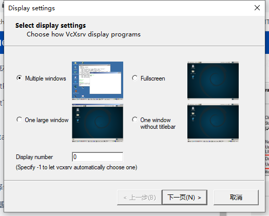
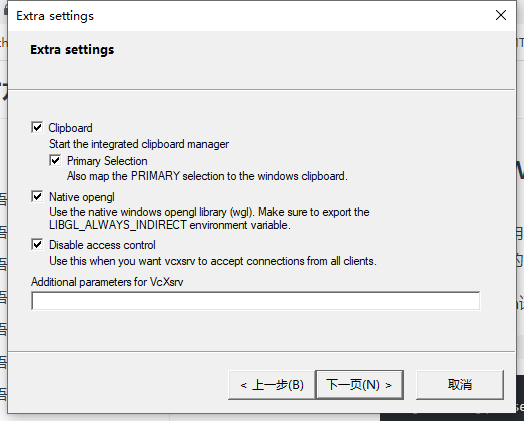

# object-detect-tracking
The car and pedestrain detect and track

##### MarkDown语法：https://markdown.com.cn/basic-syntax/

## vscode debug env set
一般我么在windows端使用vscode远程连接linux服务器来进行代码的编辑和调试，但是代码中如果涉及图像显示部分，就会导致程序运行失败。这里主要介绍如果在Windows下远程调试和运行有图像显示代码。
1. 安装VcXsrv:可在[SOURCEFORGE网站](https://sourceforge.net/projects/vcxsrv/)下载安装；
2. 在安装路径下找到X0.hosts，然后输入Windons电脑的IPv4地址
3. 在vscode终端输入：**export DISPLAY=IPv4:0.0**
4. 在Windows运行VcXsrv程序XLaunch,有两点需要注意，如下图所示，其余按默认设置继续下一步即可。

